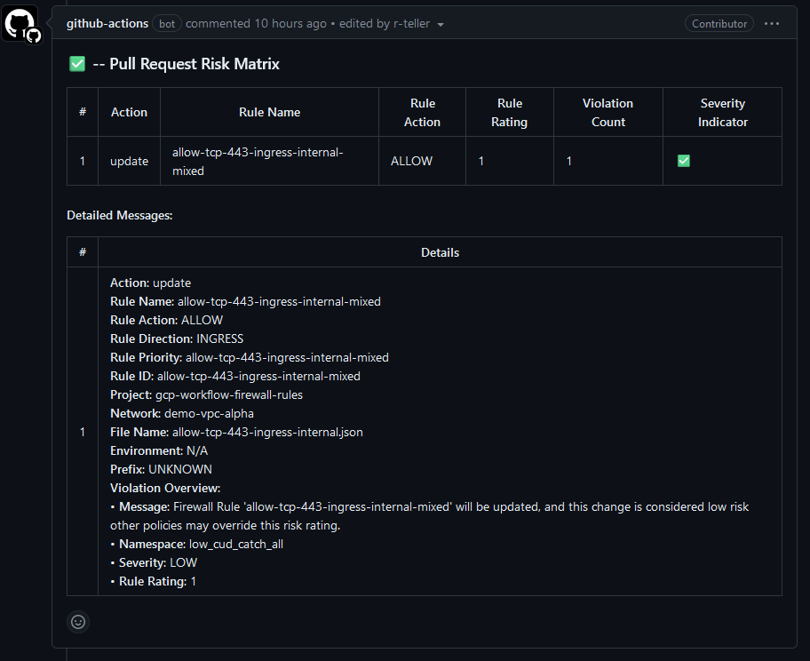
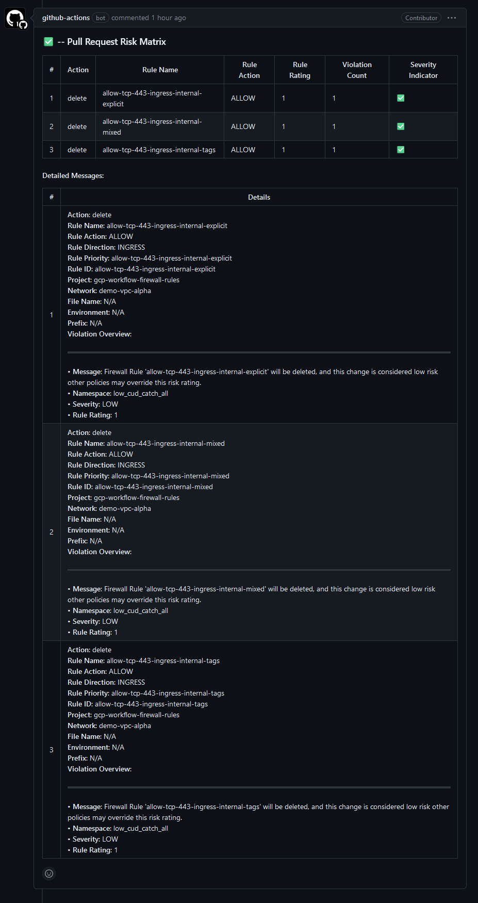
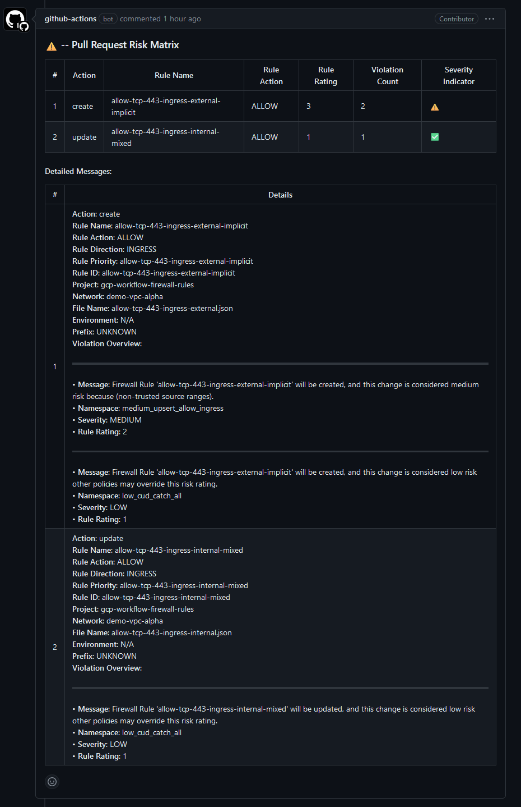
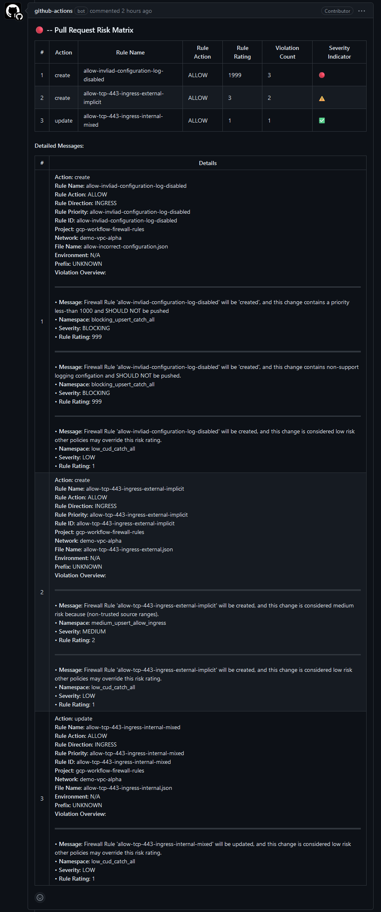

# Self-Service Firewall Management Guide

## Overview
This guide outlines an example workflow setup designed to enhance self-service capabilities for firewall management within a Google Cloud Platform (GCP) environment. The goal is to empower application owners to self-manage firewall rules effectively using GitHub Actions, Terraform, and Open Policy Agent (OPA). This approach ensures a secure, compliant, and automated method for network configuration management. By leveraging these technologies, users can benefit from streamlined operations, reduced manual errors, and a robust compliance posture. 

This guide is intended for application owners with a basic to intermediate understanding of cloud networking concepts and infrastructure as code principles.

For detailed policy information, see the [Policy Guide](policy.md).

## Prerequisites
- Access to the GitHub repository with permissions to create branches and pull requests.
- Basic understanding of JSON for defining firewall rules.

## Workflow Overview
1. Define Firewall Rules: Users submit firewall rule changes by adding or modifying JSON files in a specific directory within the GitHub repository.
2. Automated Review Process: Upon pull request creation, GitHub Actions will automatically perform OPA compliance checks and a Terraform plan to preview changes.
3. Approval and Application: Low-risk changes (as determined by OPA policies) are automatically merged and applied. High-risk changes require manual review and approval.

## Defining Firewall Rules
Firewall rules are defined using JSON format in the `./rules` directory. Each JSON file should contain rules that pertain to specific projects or networks within your organization.

### JSON Rule Format
- **Low-Risk Rule Example (auto-approved):**
  ```json
  [
      {
          "id": "allow-tcp-443-ingress-internal-explicit",
          "name": "allow-tcp-443-ingress-internal-explicit",
          "action": "allow",
          "direction": "INGRESS",
          "log_config": "INCLUDE_ALL_METADATA",
          "sources": ["192.168.0.0/16", "10.0.0.0/21"],
          "rules": [{"protocol": "TCP", "ports": ["443"]}]
      }
  ]
  ```
- **High-Risk Rule Example (requires manual review):**
  ```json
  [
      {
          "id": "allow-tcp-443-ingress-external-explicit",
          "name": "allow-tcp-443-ingress-external-explicit",
          "action": "allow",
          "direction": "INGRESS",
          "log_config": "INCLUDE_ALL_METADATA",
          "sources": ["0.0.0.0/0"],
          "rules": [{"protocol": "TCP", "ports": ["443"]}]
      }
  ]
  ```

## Submission Process
1. Create a Branch: For new firewall rules or modifications, create a new branch in the repository.
2. Add or Modify Rules: Place your JSON-formatted rule definitions in the appropriate directory.
3. Create a Pull Request: Submit your changes for review by creating a pull request against the main branch.

## Automated Review and Deployment
GitHub Actions Workflows automatically perform compliance checks and preview changes upon pull request creation. For detailed policy information, see the [Policy Guide](policy.md).

This process includes:

- **Compliance Checks:** Using Open Policy Agent (OPA), the workflow reviews rule changes for compliance with predefined policies.
- **Change Preview:** Terraform `plan` command is used to preview proposed changes in a detailed and structured format.
- **Risk Assessment:** Each change is assessed for risk based on OPA findings. A total risk rating is calculated, determining the approval workflow.
- **Pull Request Commenting:** For enhanced transparency, the workflow automatically posts comments on pull requests, summarizing the risk assessment and providing a detailed risk matrix.
- **Conditional Auto-Approval:** Changes with a low total risk rating are automatically approved. High-risk changes are flagged for manual review by authorized personnel.
- **Label Management:** Pull requests are automatically labeled based on their risk assessment outcome, facilitating easier management and prioritization.

### Approval Process
- **Auto-Approval Criteria:** Changes that pass compliance checks with a low total risk rating are automatically approved.
- **Manual Review:** Changes with a high total risk rating, indicating potential compliance or security concerns, require manual approval.


## Folder Hierarchy for Firewall Rules
Organize firewall rule files within the repository based on their corresponding GCP configurations:
```
./rules/
│
├── <project_id>/
│   ├── <network_name>/
│   │   ├── <rule_set_name>.json
│   ...
```
- **Project ID** folders represent GCP projects.
- **Network Name** subfolders represent VPC networks.
- **Rule Set Name** `.json` files contain firewall rule definitions.

### Mapping to GCP
Ensure folder and file names accurately reflect their GCP counterparts for correct rule application.

## References
- [Conftest](https://conftest.dev)
- [Open Policy Agent (OPA)](https://www.openpolicyagent.org/)
- [Terraform Firewall Rule Module](https://github.com/r-teller/terraform-google-firewall-rules)
- 

## Examples:
### Example: Running Terraform Plan and Policy Evaluation

The following example shows how to execute a Terraform plan, output the plan to a JSON file, and then use Docker to run `conftest` for evaluating the plan against your OPA policies.

First, generate the Terraform plan:

```bash
terraform plan -out=tfplan  -var generate_firewall_rules_map_json=true
```

Next, output the plan to a JSON file for analysis:

```bash
terraform show -json tfplan > tfplan.json
```

Finally, use Docker to run `conftest` against the generated plan:

```bash
docker run --rm -v "$(pwd)":/project openpolicyagent/conftest test --all-namespaces ./tfplan.json --output json > result.json
```

This process will generate a `result.json` file containing the results of the policy evaluation, which can be used to identify potential compliance issues with the proposed changes.

### Example: Github Action Workflows
#### Low Risk Change - Update


#### Low Risk Change - Delete


#### Medium to Critical Risk Change - Update 


#### Blocking Risk Change - Update


## Contributions and Support
- **Contributing:** Ensure your firewall rule changes meet the compliance and risk assessment criteria for smooth approval. Follow the submission process detailed above. Refer to the [Policy Guide](policy.md) for more information on compliance requirements.
- **Support:** For assistance, questions, or issues, open an issue in the GitHub repository or contact the infrastructure team directly.
